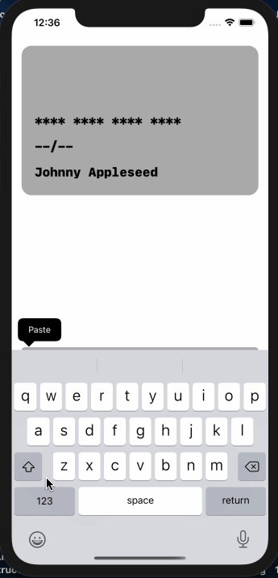

# AnimatedCard

Animated credit or debit card form

---

[![GitHub Issues][issues-image]][issues-url]
[![Swift Version][swift-image]][swift-url]
[![License][license-image]][license-url]
[![GitHub Pull Requests][pr-image]][pr-url]

---



---

## Installation

Instructions to download/fork and clone and get project running

- Step 1:

```shell
$ git clone https://github.com/mazjap/AnimatedCard
```

- Step 2:

```shell
$ open AnimatedCard/CardAnimation/CardAnimation.xcodeproj
```

- Step 3:

> Add code, fix bugs, or look through the project

---

## Documentation

Please refer to the [wiki][wiki-url] for technical details on the project.

---

## Contributing

1. :fork_and_knife: Fork this repo!

2. :dancers: Clone your newly forked repo to your local machine using:
```shell
$ git clone https://github.com/mazjap/AnimatedCard
```
3. :computer: Add some code

4. :leftwards_arrow_with_hook: Create a new pull request using [`https://github.com/mazjap/AnimatedCard/compare/`](https://github.com/mazjap/AnimatedCard/compare/) and fill in relevant info.

---

## Contributors

| [Jordan Christensen](https://jordan-christensen.com/) |
| :---: |
| [](https://github.com/mazjap) |
| [ ](https://github.com/mazjap) |
| [ ](https://www.linkedin.com/in/jordan-a-christensen/) |

---

## Attribution

- This README was adapted from [fvcproductions](https://github.com/fvcproductions/)'s [sampleREADME](https://gist.github.com/fvcproductions/1bfc2d4aecb01a834b46).md.
- The pull request template was adapted from [this PULL_REQUEST_TEMPLATE](https://github.com/embeddedartistry/templates/blob/master/oss_docs/PULL_REQUEST_TEMPLATE.md).md

---

## License

[![License][license-image]][license-url]

- **[MIT license][license-url]**
- Copyright 2020 © [Jordan Christensen][website-url].

<!-- Project Images -->
[project-icon]: https://avatars2.githubusercontent.com/u/24785257?s=200

<!-- Badge Images -->
[issues-image]: https://img.shields.io/github/issues/mazjap/AnimatedCard "Issues"
[license-image]: https://img.shields.io/badge/License-MIT-blue "License"
[pr-image]: https://img.shields.io/github/issues-pr/mazjap/AnimatedCard "Pull Requests"
[swift-image]: https://img.shields.io/badge/Swift-5.2-green "Swift"

<!-- URL's -->
[no-link]: #
[issues-url]: ../../issues
[swift-url]: https://swift.org/
[license-url]: LICENSE
[pr-url]: ../../pulls
[wiki-url]: ../../wiki
[website-url]: https://jordan-christensen.com
